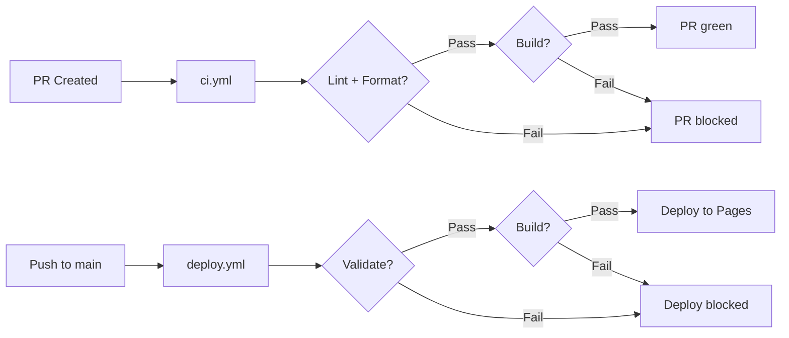

# Design Document

## Overview

This design describes the Event-Driven Serverless Walkthrough documentation site — a 10-section progressive guide built with Astro 6 + Starlight 0.40.x that documents the `event-driven-serverless-platform-demo` project.

The site is purely content-organizational: section subdirectories under `src/content/docs/`, navigation configured in `astro.config.mjs`, and deployment to GitHub Pages at `/aws-event-driven-serverless-walkthrough/`. The end result is 32 content pages across 10 sidebar sections plus the splash page.

This design does not change runtime behavior in the demo platform or Terraform modules; it only defines documentation structure and content quality.

The site follows the same conventions as the [aws-iot-walkthrough](https://github.com/jajera/aws-iot-walkthrough) reference project: MDX content, `starlight-theme-vintage`, `starlight-base-path`, and CI/deploy via actionsforge reusable workflows.

### Design Decisions

1. **One file per page** — Each sidebar-visible page is a single `.mdx` file. No file contains multiple sidebar entries.
2. **Directory-per-section** — Each of the 10 sections maps to exactly one subdirectory under `src/content/docs/`.
3. **Slug-based sidebar references** — The sidebar uses `slug` format (`section/filename`) matching the filesystem path, which is the Starlight convention.
4. **Content sourced from Demo_Repo** — Walkthrough commands, architecture, and data contracts are derived from `event-driven-serverless-platform-demo` (`docs/ARCHITECTURE.md`, `docs/WALKTHROUGH.md`, `terraform/`, `services/`, `web/`).
5. **Astro 6 + Starlight 0.40.x** — Matches the reference project's proven stack for documentation sites.
6. **starlight-base-path plugin** — Handles the `/aws-event-driven-serverless-walkthrough/` prefix required by GitHub Pages project sites.
7. **MDX over MD** — Enables Starlight components (hero, card-grid, tabs, aside) within documentation pages.

## Architecture

The site architecture is a static Astro Starlight site deployed to GitHub Pages.

```text
┌─────────────────────────────────────────────────────┐
│  astro.config.mjs                                   │
│  ┌───────────────────────────────────────────────┐  │
│  │  sidebar: [Home, 10 Section groups]           │  │
│  │  plugins: [starlightThemeVintage, basePath]    │  │
│  └───────────────────────────────────────────────┘  │
└─────────────────────────────────────────────────────┘
        │
        ▼
┌─────────────────────────────────────────────────────┐
│  src/content/docs/                                  │
│  ├── index.mdx  (splash)                            │
│  ├── introduction/ … reference/                     │
│  src/content.config.ts                              │
│  public/favicon.svg                                 │
└─────────────────────────────────────────────────────┘
        │
        ▼
┌─────────────────────────────────────────────────────┐
│  Astro Build → dist/ → GitHub Pages                 │
│  https://jajera.github.io/aws-event-driven-         │
│    serverless-walkthrough/                          │
└─────────────────────────────────────────────────────┘
```

### Build and Validation Pipeline

```bash
npm run validate
  ├── prettier --check .
  └── markdownlint-cli2 "src/**/*.mdx"

npm run test   # alias for astro build
npm run build
  └── astro build (validates all sidebar slugs resolve to files)
```

For iterative edits during implementation, validators may be run against changed files first; final acceptance still requires `npm run validate` and `npm run build` to pass.

### CI/CD Integration

| Workflow     | Trigger                             | Reusable workflow                                                      | Key inputs                                                                               |
| ------------ | ----------------------------------- | ---------------------------------------------------------------------- | ---------------------------------------------------------------------------------------- |
| `ci.yml`     | Pull request                        | `actionsforge/actions/.github/workflows/astro-docs-pr-checks.yml@main` | Default (validate + build)                                                               |
| `deploy.yml` | Push to `main`, `workflow_dispatch` | `actionsforge/actions/.github/workflows/astro-pages-deploy.yml@main`   | `node-version: "22"`, `validate-command: npm run validate`, `test-command: npm run test` |



## Components and Interfaces

### Project Root Files

| File                    | Purpose                                                            |
| ----------------------- | ------------------------------------------------------------------ |
| `package.json`          | Dependencies, npm scripts, project metadata                        |
| `astro.config.mjs`      | Astro + Starlight configuration, sidebar, theme, base path         |
| `tsconfig.json`         | TypeScript strict mode, extends Astro's base config                |
| `src/content.config.ts` | Starlight docs collection schema (`title`, `description` required) |
| `src/env.d.ts`          | Astro type references                                              |
| `.nvmrc`                | Pins Node.js 22                                                    |
| `.prettierrc`           | Semicolons, double quotes, tab width 2, trailing commas `all`      |
| `.prettierignore`       | Excludes build artifacts and dependencies                          |
| `.markdownlint.json`    | Markdownlint rules for MDX content                                 |
| `.gitignore`            | Excludes `node_modules/`, `dist/`, `.astro/`                       |
| `public/favicon.svg`    | Site favicon                                                       |

### Astro Configuration (`astro.config.mjs`)

```typescript
import { defineConfig } from "astro/config";
import starlight from "@astrojs/starlight";
import starlightThemeVintage from "starlight-theme-vintage";
import { starlightBasePath } from "starlight-base-path";

export default defineConfig({
  site: "https://jajera.github.io",
  base: "/aws-event-driven-serverless-walkthrough/",
  integrations: [
    starlight({
      title: "Event-Driven Serverless Walkthrough",
      favicon: "/favicon.svg",
      description:
        "Step-by-step walkthrough for the AWS event-driven serverless GNSS platform — ingest, TEC processing, and visualization.",
      plugins: [starlightThemeVintage(), starlightBasePath()],
      social: [
        {
          icon: "github",
          label: "Source Repository",
          href: "https://github.com/jajera/aws-event-driven-serverless-walkthrough",
        },
      ],
      editLink: {
        baseUrl:
          "https://github.com/jajera/aws-event-driven-serverless-walkthrough/edit/main/",
      },
      sidebar: [
        { label: "Home", link: "/" },
        // … 10 section groups — see Sidebar Configuration (Target State)
      ],
    }),
  ],
});
```

**Note:** Theme styling uses the `starlightThemeVintage()` plugin, not `customCss`. The `social` field is an array of link objects, not a `{ github: url }` map.

### TypeScript Configuration (`tsconfig.json`)

```json
{
  "extends": "astro/tsconfigs/strict",
  "compilerOptions": {
    "baseUrl": ".",
    "paths": {
      "@/*": ["src/*"]
    }
  },
  "include": [".astro/types.d.ts", "**/*"],
  "exclude": ["dist"]
}
```

The `@/*` path alias matches the reference project and supports future shared components under `src/components/`.

### Content Collection (`src/content.config.ts`)

```typescript
import { defineCollection, z } from "astro:content";
import { docsLoader } from "@astrojs/starlight/loaders";
import { docsSchema } from "@astrojs/starlight/schema";

export const collections = {
  docs: defineCollection({
    loader: docsLoader(),
    schema: docsSchema({
      extend: z.object({
        description: z.string().min(1),
      }),
    }),
  }),
};
```

### Content Directory Structure

```
src/content/docs/
├── index.mdx                          # Splash page (hero + card-grid)
├── introduction/
│   └── project-overview.mdx
├── prerequisites/
│   └── tools-and-accounts.mdx
├── architecture/
│   ├── system-overview.mdx
│   └── infrastructure-layers.mdx
├── deploy/
│   ├── terraform-init.mdx
│   ├── ecr-processor-image.mdx
│   ├── staged-apply.mdx
│   ├── amplify-portal.mdx
│   └── cors-lockdown.mdx
├── verification/
│   ├── eventbridge-scheduler.mdx
│   ├── manual-ingest.mdx
│   ├── sqs-queues.mdx
│   ├── processor-lambda.mdx
│   ├── s3-processed-output.mdx
│   ├── rest-api.mdx
│   ├── reprocess-workflow.mdx
│   ├── portal.mdx
│   └── alarms-dashboard.mdx
├── data-contract/
│   ├── sqs-message-schemas.mdx
│   ├── dynamodb-jobs-table.mdx
│   ├── s3-key-patterns.mdx
│   ├── parquet-output.mdx
│   └── api-response-schemas.mdx
├── usage/
│   ├── rest-api-usage.mdx
│   ├── portal-usage.mdx
│   └── manual-ingest.mdx
├── development/
│   └── local-setup.mdx
├── troubleshooting/
│   └── common-issues.mdx
└── reference/
    ├── environment-variables.mdx
    ├── terraform-variables.mdx
    ├── terraform-outputs.mdx
    └── teardown.mdx
```

### Demo_Repo Content Sourcing

Walkthrough content is authored for the documentation site but grounded in the demo repository:

| Walkthrough section         | Primary Demo_Repo sources                                                          |
| --------------------------- | ---------------------------------------------------------------------------------- |
| Introduction / Architecture | `docs/ARCHITECTURE.md`                                                             |
| Prerequisites               | `docs/WALKTHROUGH.md` (Prerequisites), `terraform/versions.tf`                     |
| Deploy                      | `docs/WALKTHROUGH.md` (Deploy Infrastructure, Portal URLs)                         |
| Verification                | `docs/WALKTHROUGH.md` (Verification)                                               |
| Data Contract               | `docs/ARCHITECTURE.md` (Data Models), service handler code                         |
| Usage                       | `docs/WALKTHROUGH.md` (REST API, Portal), `web/src/`                               |
| Development                 | `services/ingest-sync/`, `services/query-api/`, `services/reprocess-api/`, `web/`  |
| Reference                   | `terraform/variables.tf`, `terraform/outputs.tf`, `docs/WALKTHROUGH.md` (Teardown) |
| Troubleshooting             | Operational issues from deploy/verification flows                                  |

Platform concepts documented in the walkthrough reflect the **current** demo deployment: Processor Lambda container (not AWS Batch), prefix-based catalog discovery (not S3 Annotations), and five Terraform modules (`ingest`, `ingest-scheduler`, `processing`, `presentation`, `observability`).

**Out of scope for walkthrough content** (removed from the demo; do not document as deployed):

- AWS Batch and `batch-dispatcher` Lambda
- S3 Annotations and `annotations-indexer` Lambda

### NPM Scripts Interface

| Script     | Command                                                  | Purpose                                      |
| ---------- | -------------------------------------------------------- | -------------------------------------------- |
| `dev`      | `astro dev`                                              | Local development server                     |
| `build`    | `astro build`                                            | Production static build                      |
| `preview`  | `astro preview`                                          | Preview production build locally             |
| `validate` | `prettier --check . && markdownlint-cli2 "src/**/*.mdx"` | Style + lint validation                      |
| `test`     | `astro build`                                            | Build as test (ensures no broken references) |
| `format`   | `prettier --write .`                                     | Auto-format all files                        |
| `lint`     | `markdownlint-cli2 "src/**/*.mdx"`                       | Markdown/MDX lint check                      |

### Content File Interface (MDX Frontmatter)

Every content file follows this interface:

```yaml
---
title: "Page Title"
description: "Brief description for SEO and sidebar hover"
---
```

The splash page uses the Starlight template override:

```yaml
---
title: "Event-Driven Serverless Walkthrough"
description: "Progressive walkthrough for the AWS event-driven serverless platform"
template: splash
hero:
  tagline: "A step-by-step guide to deploying an AWS event-driven platform for GNSS RINEX ingestion, TEC calibration, and visualization"
  actions:
    - text: Get Started
      link: /introduction/project-overview/
      icon: right-arrow
      variant: primary
    - text: View on GitHub
      link: https://github.com/jajera/event-driven-serverless-platform-demo
      icon: external
---
```

The splash page body imports Starlight `Card` and `CardGrid` components and links to major sections:

```mdx
import { Card, CardGrid } from "@astrojs/starlight/components";

## What you'll build

<CardGrid>
  <Card
    title="Event-driven ingest"
    icon="rocket"
    link="/architecture/system-overview/"
  >
    Scheduled GeoNet RINEX sync into a private S3 data lake via EventBridge
    Scheduler.
  </Card>
  <Card
    title="Deploy with Terraform"
    icon="setting"
    link="/deploy/terraform-init/"
  >
    Staged apply from ECR image sync through Amplify portal hosting and CORS
    lockdown.
  </Card>
  <Card
    title="Verify end-to-end"
    icon="open-book"
    link="/verification/eventbridge-scheduler/"
  >
    CLI checks for queues, processor Lambda, REST API, portal, and
    observability.
  </Card>
  <Card
    title="Query and visualize"
    icon="document"
    link="/usage/rest-api-usage/"
  >
    Catalog, query, and reprocess TEC data through the REST API and Amplify
    portal.
  </Card>
</CardGrid>
```

Card `link` values use root-relative paths (same convention as hero actions). The fifth major section (Reference) is reachable via sidebar; cards cover the four highest-traffic entry points.

### Content Page Pattern

Standard documentation pages follow this structure:

1. **Frontmatter** — `title`, `description`
2. **Intro** — one paragraph on what the page covers and any Demo_Repo context
3. **Sections** — headed steps with copy-paste bash commands run from the Demo_Repo
4. **Verification** — how to confirm the step succeeded
5. **Cross-references** — links to related Deploy, Verification, or Troubleshooting pages

Architecture pages may embed mermaid diagrams adapted from `docs/ARCHITECTURE.md` in the Demo_Repo. Static assets (diagrams, screenshots) live under `public/` and are referenced with the site base path prefix.

### Internal Link Convention

Prose cross-links between walkthrough pages use the full site base path:

```markdown
[Staged Apply](/aws-event-driven-serverless-walkthrough/deploy/staged-apply/)
```

Hero actions, sidebar entries, and Card `link` values use root-relative paths (`/deploy/staged-apply/`). External links to the Demo_Repo use full GitHub URLs.

### Prerequisites Page Pattern

The prerequisites page (`prerequisites/tools-and-accounts.mdx`) documents cloud tooling only (no hardware):

1. Intro paragraph on what the reader needs before cloning the Demo_Repo
2. HTML summary table (tool, minimum version, verify command, walkthrough usage)
3. AWS account permissions list (S3, Lambda, IAM, SQS, DynamoDB, API Gateway, Amplify, EventBridge Scheduler, CloudWatch, ECR, SNS)
4. Combined toolchain verification block
5. Note that Terraform commands run from the Demo_Repo root with `-chdir=terraform`

### Sidebar Configuration Interface

Each sidebar section uses Starlight's group format:

```typescript
{
  label: "Section Name",
  items: [
    { label: "Page Title", slug: "section-dir/page-name" },
  ],
}
```

The Home link uses the link format (not slug):

```typescript
{ label: "Home", link: "/" }
```

## Data Models

### Content File Frontmatter Schema

```yaml
---
title: string (required) # Page title shown in sidebar and heading
description: string (required) # Meta description for SEO and page subtitle
template: splash (optional) # Only on index.mdx
hero: object (optional) # Only on index.mdx
---
```

### Sidebar Configuration Schema

```javascript
sidebar: [
  { label: "Home", link: "/" },
  {
    label: "Section Name",
    items: [{ label: "Page Title", slug: "section/filename" }],
  },
];
```

### File-to-Slug Mapping

| Directory          | Filename                    | Sidebar Slug                         |
| ------------------ | --------------------------- | ------------------------------------ |
| `introduction/`    | `project-overview.mdx`      | `introduction/project-overview`      |
| `prerequisites/`   | `tools-and-accounts.mdx`    | `prerequisites/tools-and-accounts`   |
| `architecture/`    | `system-overview.mdx`       | `architecture/system-overview`       |
| `architecture/`    | `infrastructure-layers.mdx` | `architecture/infrastructure-layers` |
| `deploy/`          | `terraform-init.mdx`        | `deploy/terraform-init`              |
| `deploy/`          | `ecr-processor-image.mdx`   | `deploy/ecr-processor-image`         |
| `deploy/`          | `staged-apply.mdx`          | `deploy/staged-apply`                |
| `deploy/`          | `amplify-portal.mdx`        | `deploy/amplify-portal`              |
| `deploy/`          | `cors-lockdown.mdx`         | `deploy/cors-lockdown`               |
| `verification/`    | `eventbridge-scheduler.mdx` | `verification/eventbridge-scheduler` |
| `verification/`    | `manual-ingest.mdx`         | `verification/manual-ingest`         |
| `verification/`    | `sqs-queues.mdx`            | `verification/sqs-queues`            |
| `verification/`    | `processor-lambda.mdx`      | `verification/processor-lambda`      |
| `verification/`    | `s3-processed-output.mdx`   | `verification/s3-processed-output`   |
| `verification/`    | `rest-api.mdx`              | `verification/rest-api`              |
| `verification/`    | `reprocess-workflow.mdx`    | `verification/reprocess-workflow`    |
| `verification/`    | `portal.mdx`                | `verification/portal`                |
| `verification/`    | `alarms-dashboard.mdx`      | `verification/alarms-dashboard`      |
| `data-contract/`   | `sqs-message-schemas.mdx`   | `data-contract/sqs-message-schemas`  |
| `data-contract/`   | `dynamodb-jobs-table.mdx`   | `data-contract/dynamodb-jobs-table`  |
| `data-contract/`   | `s3-key-patterns.mdx`       | `data-contract/s3-key-patterns`      |
| `data-contract/`   | `parquet-output.mdx`        | `data-contract/parquet-output`       |
| `data-contract/`   | `api-response-schemas.mdx`  | `data-contract/api-response-schemas` |
| `usage/`           | `rest-api-usage.mdx`        | `usage/rest-api-usage`               |
| `usage/`           | `portal-usage.mdx`          | `usage/portal-usage`                 |
| `usage/`           | `manual-ingest.mdx`         | `usage/manual-ingest`                |
| `development/`     | `local-setup.mdx`           | `development/local-setup`            |
| `troubleshooting/` | `common-issues.mdx`         | `troubleshooting/common-issues`      |
| `reference/`       | `environment-variables.mdx` | `reference/environment-variables`    |
| `reference/`       | `terraform-variables.mdx`   | `reference/terraform-variables`      |
| `reference/`       | `terraform-outputs.mdx`     | `reference/terraform-outputs`        |
| `reference/`       | `teardown.mdx`              | `reference/teardown`                 |

### Sidebar Configuration (Target State)

```javascript
sidebar: [
  { label: "Home", link: "/" },
  {
    label: "Introduction",
    items: [
      { label: "Project Overview", slug: "introduction/project-overview" },
    ],
  },
  {
    label: "Prerequisites",
    items: [
      { label: "Tools and Accounts", slug: "prerequisites/tools-and-accounts" },
    ],
  },
  {
    label: "Architecture",
    items: [
      { label: "System Overview", slug: "architecture/system-overview" },
      {
        label: "Infrastructure Layers",
        slug: "architecture/infrastructure-layers",
      },
    ],
  },
  {
    label: "Deploy",
    items: [
      { label: "Terraform Init", slug: "deploy/terraform-init" },
      { label: "ECR and Processor Image", slug: "deploy/ecr-processor-image" },
      { label: "Staged Apply", slug: "deploy/staged-apply" },
      { label: "Amplify Portal", slug: "deploy/amplify-portal" },
      { label: "CORS Lockdown", slug: "deploy/cors-lockdown" },
    ],
  },
  {
    label: "Verification",
    items: [
      {
        label: "EventBridge Scheduler",
        slug: "verification/eventbridge-scheduler",
      },
      { label: "Manual Ingest", slug: "verification/manual-ingest" },
      { label: "SQS Queues", slug: "verification/sqs-queues" },
      { label: "Processor Lambda", slug: "verification/processor-lambda" },
      {
        label: "S3 Processed Output",
        slug: "verification/s3-processed-output",
      },
      { label: "REST API", slug: "verification/rest-api" },
      { label: "Reprocess Workflow", slug: "verification/reprocess-workflow" },
      { label: "Portal", slug: "verification/portal" },
      { label: "Alarms and Dashboard", slug: "verification/alarms-dashboard" },
    ],
  },
  {
    label: "Data Contract",
    items: [
      {
        label: "SQS Message Schemas",
        slug: "data-contract/sqs-message-schemas",
      },
      {
        label: "DynamoDB Jobs Table",
        slug: "data-contract/dynamodb-jobs-table",
      },
      { label: "S3 Key Patterns", slug: "data-contract/s3-key-patterns" },
      { label: "Parquet Output", slug: "data-contract/parquet-output" },
      {
        label: "API Response Schemas",
        slug: "data-contract/api-response-schemas",
      },
    ],
  },
  {
    label: "Usage",
    items: [
      { label: "REST API Usage", slug: "usage/rest-api-usage" },
      { label: "Portal Usage", slug: "usage/portal-usage" },
      { label: "Manual Ingest", slug: "usage/manual-ingest" },
    ],
  },
  {
    label: "Development",
    items: [{ label: "Local Setup", slug: "development/local-setup" }],
  },
  {
    label: "Troubleshooting",
    items: [{ label: "Common Issues", slug: "troubleshooting/common-issues" }],
  },
  {
    label: "Reference",
    items: [
      {
        label: "Environment Variables",
        slug: "reference/environment-variables",
      },
      {
        label: "Terraform Variables",
        slug: "reference/terraform-variables",
      },
      { label: "Terraform Outputs", slug: "reference/terraform-outputs" },
      { label: "Teardown", slug: "reference/teardown" },
    ],
  },
];
```

### Dependency Model (`package.json`)

| Package                   | Version | Purpose                               |
| ------------------------- | ------- | ------------------------------------- |
| `astro`                   | ^6.4.x  | Static site framework                 |
| `@astrojs/starlight`      | ^0.40.0 | Documentation theme                   |
| `starlight-theme-vintage` | ^0.1.0  | Visual styling theme (plugin)         |
| `starlight-base-path`     | ^0.1.1  | GitHub Pages base path handling       |
| `sharp`                   | ^0.34.0 | Image optimization (Astro dependency) |

Dev dependencies:

| Package             | Version | Purpose                        |
| ------------------- | ------- | ------------------------------ |
| `prettier`          | ^3.5.0  | Code formatter                 |
| `markdownlint-cli2` | ^0.22.1 | MDX/Markdown linting           |
| `typescript`        | ^5.8.0  | Type checking for config files |

Recommended `overrides` (match reference project for transitive dependency hygiene):

```json
{
  "esbuild": "^0.28.1",
  "js-yaml": "^4.2.0",
  "markdown-it": "^14.2.0"
}
```

## Correctness Properties

_A property is a characteristic or behavior that should hold true across all valid executions of a system — essentially, a formal statement about what the system should do._

### Property 1: Sidebar slug integrity

_For any_ sidebar entry defined in `astro.config.mjs`, the referenced slug SHALL correspond to an existing `.mdx` file at `src/content/docs/{slug}.mdx`, and the Astro build SHALL fail with a non-zero exit code if any slug is unresolvable.

**Validates: Requirements 18.4, 17.4**

### Property 2: Validate script completeness

_For any_ invocation of `npm run validate`, the command SHALL run both `prettier --check .` and `markdownlint-cli2 "src/**/*.mdx"` and return exit code 0 only when both succeed.

**Validates: Requirements 1.5, 17.3**

## Error Handling

Since this is a static documentation site, error handling applies at build and validation time:

| Error Type                    | Detection                                   | Resolution                                                          |
| ----------------------------- | ------------------------------------------- | ------------------------------------------------------------------- |
| Broken sidebar slug reference | `astro build` fails with missing page error | Ensure slug matches `{dir}/{filename}` per file-to-slug table       |
| Invalid MDX syntax            | `astro build` fails with parse error        | Fix MDX syntax (unclosed tags, invalid JSX)                         |
| Missing frontmatter fields    | Content collection schema rejects file      | Add required `title` and `description`                              |
| Invalid base path             | Site assets 404 in production               | Verify `base` ends with `/aws-event-driven-serverless-walkthrough/` |
| Formatting violations         | `prettier --check` exits non-zero           | Run `npm run format`                                                |
| Markdown lint violations      | `markdownlint-cli2` exits non-zero          | Fix per `.markdownlint.json` rules                                  |
| Broken internal links         | Manual review or 404 in preview             | Update links to new section slugs                                   |

## Testing Strategy

Property-based testing is **not applicable** to this feature. The site consists of MDX content, Astro/Starlight configuration, and CI workflow YAML — there are no pure functions or algorithms to test with generated inputs.

### Validation Approach

| Check           | Command                            | What it validates                                           |
| --------------- | ---------------------------------- | ----------------------------------------------------------- |
| Formatting      | `prettier --check .`               | Consistent style across all source files                    |
| Markdown lint   | `markdownlint-cli2 "src/**/*.mdx"` | MDX quality rules                                           |
| Build integrity | `astro build`                      | Sidebar slugs resolve, frontmatter valid, no broken imports |
| Combined        | `npm run validate`                 | Prettier + markdownlint in one pass                         |
| CI              | `ci.yml` on PR                     | All checks run via actionsforge reusable workflow           |
| Deploy          | `deploy.yml` on main               | Validate, build, publish to GitHub Pages                    |

### Manual Review Checklist

1. All 32 content pages render correctly in the sidebar
2. Section order matches Requirement 4 exactly
3. Splash page hero and CardGrid navigate to Introduction and major sections
4. Walkthrough commands match current `event-driven-serverless-platform-demo` behavior
5. Architecture content reflects Processor Lambda (not Batch) and prefix-based catalog (not S3 Annotations)
6. Internal cross-references between Deploy, Verification, and Troubleshooting resolve correctly
7. API Gateway URL vs Amplify portal URL distinction is clear in Usage and Verification pages
8. Teardown instructions include emptying the Data_Lake_Bucket before destroy
9. Splash page links to the Demo_Repo as the hands-on deployment target

### Incremental Build Strategy

The target sidebar and file-to-slug mapping in this document define the **final** state. During implementation, use one of these approaches so `astro build` passes at each checkpoint:

1. **Incremental sidebar** — Add sidebar groups only when their Content_Files exist; expand toward the target state in `tasks.md` checkpoint order.
2. **Stub pages** — Create minimal stub `.mdx` files (title + description only) for all 32 pages during scaffolding, then replace stubs with full content progressively.

The final `astro.config.mjs` sidebar must exactly match the target state before release. See `tasks.md` for the phased implementation plan and checkpoint gates.

### Execution Order

1. Scaffold project root files (`package.json`, `astro.config.mjs`, `tsconfig.json`, lint/format config, `.gitignore`)
2. Add `src/content.config.ts`, `src/env.d.ts`, `public/favicon.svg`
3. Create section subdirectories and content pages per `tasks.md` waves
4. Write splash page (`index.mdx`) with hero and CardGrid, then Introduction
5. Author remaining content pages sourced from Demo_Repo docs
6. Converge sidebar in `astro.config.mjs` to the target state
7. Run `npm run validate` — must pass
8. Run `npm run build` — must pass
9. Verify GitHub Pages deployment from `deploy.yml`
